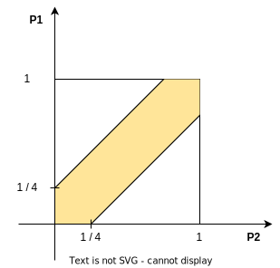

# Теория вероятностей

Сформировалась в XX веке. Начало берет из XVI века.

## Классическое определение вероятности

Игральная кость. Шесть вариантов $w_1, w_2, \ldots, w_6$.

1.  Этими вариантами исчерпываются все возможности - _исходы_
2.  Эти исходы - _попарно несовместимы_, т.е. одновременно произойти не могут
3.  Кость сделана из идеально однородного материала, т.е. все исходы - _равновозможны_

Это интуитивно понятное определение.

Если в рамках эксперимента существуют исходы $w_1, w_2, \ldots, w_n$ и условия 1, 2, 3 удовлетворяются, то вероятность $i$-го исхода:

$$
P(w_i) := \frac{1}{n}
$$

$\Omega = \{ w_1, \ldots, w_n \}$ - множество или пространство _элементарных событий_.

Кроме элементарных событий есть просто _события_. Например, кость выпала стороной, на которой простое число.

> $1$ не считается простым числом

_Событие_ - это произвольное подмножество $\Omega$.

Событие состоит из тех исходом, которые _благоприятствуют_ этому событию.

Существует $2^n$ различных подмножеств $\Omega$.

Среди событий есть и само событий $\Omega$, которое называют _достоверным событием_, т.е. оно происходит всегда, а есть пустое множество - это _невозможное событие_.

Если $A$ - событие.
$$
P(A) := \frac{\mid A \mid} {n}
$$

$\mid A \mid$ - количество элементарных исходов, которые благоприятствуют событию $A$, т.е. _мощность_.

Пусть $A, B \subseteq \Omega$ - события.

$\overline{A} = \Omega\  \backslash\ A$ - _отрицание_ события $A$, т.е. исходы, которые не благоприятствуют $A$.

$A \cup B$ - $A$ или $B$; либо $A$, либо $B$

$A \cap B$ - $A$ и $B$

Свойства
1. $P(A) \in [0, 1]$
2. $P(A) = 1 \iff A = \Omega$
3. $P(\overline{A}) = 1 - P(A)$
4. $P(A\cup B) = P(A) + P(B) - P (A \cap B)$
5. Формула включения исключений
$$
P(A_1 \cup \ldots \cup A_m) = P(A_1) + \cdots + P(A_M) - \\
- P(A_1 \cap A_2) - \cdots - P(A_{m-1} \cap A_m) + \ \ \leftarrow C_m^2\ раз\\
+ P(A_1 \cap A_2 \cap A_3) + \cdots -  \ \ \leftarrow C_m^3\ раз\\
\vdots \\
+(-1)^{m-1} P(A_1 \cap A_2 \cap \ldots \cap A_m)
$$

> $\displaystyle C_m^2 = \frac{m (m-1)}{2}$ - количество способов выбрать $2$ объекта из $m$ без учета порядка

6. $\displaystyle P(A_1 \cup A_2 \cup \ldots \cup A_m) \leq \sum\limits_{i=1}^m P(A_i)$

### Задача о беспорядках

В аудитории $70$ человек и за каждым закреплено особое место.
Всего $70$ мест.
Все выходят, затем снова заходят и занимают какие-то места случайным образом.
Какова вероятность, что никто не окажется на своем месте, т.е. все сядут на "чужие"?

$\Omega = \{w_1, \ldots , w_{70!}\}$ - элементарные события, т.е. все возможные рассадки. Их $70!$.

События:

$A_1$ - рассадки, в которых $1$-ый человек сидит на своем месте

$A_2$ - рассадки, в которых $2$-ой человек сидит на своем месте

$\vdots$

$A_{70}$ - рассадки, в которых $70$-ой человек сидит на своем месте

События $A_1, A_2, \ldots, A_{70}$ - пересекаются

Искомая вероятность $\displaystyle P = \frac{70! - \mid A_1 \cup A_2 \cup \ldots \cup A_{70} \mid}{70!} = 1 - P(A_1 \cup A_2 \cup \ldots \cup A_{70})$

$$
\mid A_1 \cup A_2 \cup \ldots \cup A_{70} \mid = \\
\mid A_1 \mid + \cdots + \mid A_{70} \mid - \\
- \mid A_1 \cup A_2 \mid + \cdots + \mid A_{69} \cup A_{70} \mid + \\
\vdots \\
+ \mid A_1 \cup \ldots \cup A_{69} \mid + \cdots + \mid A_2 \cup \ldots \cup A_{70} \mid - \\
- \mid A_1 \cup \ldots \cup A_{70} \mid = \\
C_{70}^1 \cdot 69! - \\
- C_{70}^2 \cdot 68! + \\
\vdots \\
+ C_{70}^{69} \cdot 1! - \\
+ C_{70}^{70} \cdot 0!\\
$$

Имеем
$$
\displaystyle
\frac{70! - \mid A_1 \cup A_2 \cup \ldots \cup A_{70} \mid}{70!} = \\
= 1 - \frac{70!}{1! \cdot 69!}\cdot\frac{69!}{70!} + \frac{70!}{2! \cdot 68!}\cdot\frac{68!}{70!} - \\
\ \\
- \frac{70!}{3! \cdot 67!}\cdot\frac{67!}{70!} + \cdots + \frac{70!}{69! \cdot 1!}\cdot\frac{1!}{70!} - \frac{70!}{70! \cdot 0!}\cdot\frac{0!}{70!} = \\
\ \\
= 1 - \frac{1}{1!} + \frac{1}{2!} - \frac{1}{3!} + \cdots + \frac{1}{69!} -\frac{1}{70!} \approx e^{-1}
$$

> $\displaystyle e^x = 1 + x + \frac{x^2}{2!}+ \frac{x^3}{3!}+ \frac{x^4}{4!} + \cdots$

Неправильный вариант решения.

С какой вероятностью один человек сядет на свое место? $\displaystyle \frac{69}{70}$. И так каждый из $70$.

Если бы эти события были независимы, то ответ бы был $\displaystyle \bigg( \frac{69}{70} \bigg)^{70} = \bigg(1 - \frac{1}{70} \bigg)^{70}$.

Но это ошибка, так как события зависимы. Хотя это решение дает тот же самый результат, что и правильное! Очевидно, что при большом количестве людей события становятся не сильно зависимы.

## Геометрическая вероятность

### Задача о встрече

Два человека договорились встретиться на автобусной остановке. Они приходят в случайный момент времени и ждут $15$ минут. Все это происходит с $9$ до $10$ утра, т.е. в рамках одного часа.

Какова вероятность их встречи?

Можно попытаться делить час на минуты/секунды/..., т.е. свести задачу к дискретной постановке, но все равно не понятно на сколько нужно дробить час.

Нужно найти множество точек, для которых $\displaystyle \mid P_1 - P_2 \mid \leq \frac{1}{4}$.

$\displaystyle P(A) = \frac{7}{16}$

Элментарным исходом является пара моментов времени. Количество элементарных исходов бесконечно.

Событие (встреча) - образуют множество точек внутри области.

$$
P(A) = \frac{\mu(A)}{\mu(\Omega)}
$$

$\mu$ - мера Жордана, т.е. площадь. В нашем случае $\mu(\Omega) = 1, \Omega = [0,1]^2$.

Свойства
1. $P(A) \in [0, 1]$
2. $P(A) = 1 \Leftarrow A = \Omega$ **Не так как с классической вероятностью**
3. $P(\overline{A}) = 1 - P(A)$
4. $P(A\cup B) = P(A) + P(B) - P (A \cap B)$

В классическом определении любое множество элементарных исходов - событие.

Но множество точек с рациональными координатами внутри квадрата не имеет меры Жордана, т.е. нельзя измерить площадь.

В геометрической вероятности не каждое множетво элементарных исходов можно считать событием, так как просто нельзя подсчитать вероятность.

Геометрическая вероятность - предельный аналог классической вероятности. Схожесть в том, что элементарные исходы - равновероятны.

### Строгое определение геоментрической вероятности

Множество точек, расположенных в $\R^n$ - $n$-мерноем пространстве - множество элементарных исходов, которые равновероятны и образуют $\Omega$.

В $\Omega$ выделено некоторое семейство подмножеств. $\displaystyle\mathcal{F}\subset 2^\Omega$ - событие, которое замкнуто относительно операций объединения и пересечения.
При этом каждое множество из $\mathcal{F}$ имеет меру $\mu$.

Тогда
$$
P(A) := \frac{\mu(A)}{\mu(\Omega)},\ A \in\mathcal{F}
$$