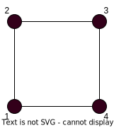

## Случайное блуждание (по прямой)

На прямой указаны целые числа.

В точке $0$ находится кабак и $0$-ой момент времени из него выходит пьяница. Он случайным образом двигается по целым точкам с шагом $1$. Причем вероятности того, что он пойдет в ту или иную стороны разный, так как дорога, например, имеет наклон.

Возникают вероятность $p$ и $q$ как в схеме Бернулли.

Нужно найти вероятность того, что через $n\in \mathbb N$ шагов, пьяница окажется в точке $k \in \mathbb Z$. Назовем эту вероятность  $P(k,n)$.

Пусть $x$ - число сделанных вправо шагов. Тогда $n-x$ - число шагов влево.

После этих шагов пьяница должен оказаться в точке $x - (n - x) = 2x - n$.

Т.е. $k = 2x - n$ или $\displaystyle x = \frac{k+n}{2}$.

Ясно, что если $k+n$ - нечетное число, то $P(k,n) = 0$.

Окончательно имеем
$$
 P (k,n) =
\Bigg\{
\begin{array}{ll}
C_n^x\cdot p^x \cdot q^{n-x}, & 2 \mid n\\
0, &  2 \nmid n\\
\end{array}
$$

## Случайные графы

$G(V,E)$ - объект, называемый _граф_, который представляет собой пару $V$ и $E$. $V$ - конечное множество _вершин_, а $E$ - набор двух элементарных подмножеств множества $V$, который называют множеством _ребер_.

Рассматривает граф, у которого нет ориентации, нет петель и нет кратных ребер.

Пусть $V = \{1,2,\ldots, n\}$.

Сколько разных графом можно построить на этом множестве вершин?

Ответ: $\displaystyle 2^{C_n^2} = 2 ^ { \frac{n(n-1)}{2}}$, где $C_n^2$ - количество всех неориентированных ребер из $n$ вершин.

Пусть $p$ - вероятность того, что ребро появится в графе, а $q = 1 - p$, что не появится.

Положим $n = 4$.

С какой вероятностью появится этот граф?

Так как $C_4^2=6$, то существует $6$-ребер и следовательно вероятность появления данного графа $P = p^4\cdot q^2$.

> Модель Эрдёша-Реньи. 1959 год. $G(n,p)$ - обозначение случайного графа в модели Эрдёша-Реньи.

Найдем вероятность того, что $G(n,p)$ является циклом, т.е. многоугольником на плоскости.

$$
P = p^n\cdot q^{C_n^2-n} \cdot \frac{(n-1)!}{2}
$$

Если цикл на $n$ вершинах, то имеем $n!$ перестановок. Все циклические сдвиги дают то же самое, и то же самое дает проход в обратную сторону, т.е. $\displaystyle \frac{n!}{n\cdot 2} = \frac{(n-1)!}{2}$.

Обозначим через $\mu_n$ - количество успехов в схеме из $n$ испытаний Бернулли.

$$
P(\mu_n = k) = C_n^k\cdot p^k \cdot q^{n-k}
$$

$$
P(a \leq \mu_n \leq b) = \sum\limits_{k=a}^b C_n^k\cdot p^k \cdot q^{n-k}
$$

## Предельные теоремы

**Теорема Пуассона**

Пусть $P = P(n)$, т.е. $P$ зависит от $n$, от числа испытаний. Причем $np \thicksim C$ или $(\displaystyle P \thicksim \frac{C}{n})$, где $C > 0$ - некоторая константа.

> $\thicksim$ означает "ассимптотически равно".

> $\displaystyle f(n) \thicksim g(n) \iff \frac{f(n)}{g(n)}\xrightarrow[n \to \infty]{}1$

Тогда $\displaystyle P(\mu_n = k) \thicksim \frac{C^k \cdot e^{-C}}{k!}$. Будем считать, что $k$ - константа.

> Если $k$ зависит от $n$, то может быть проблема.
> 
> Так как $\displaystyle 1 + \frac{1}{n} \thicksim 1$ и $\displaystyle\bigg(1 + \frac{1}{n}\bigg)^n \thicksim e$, но $1 \neq e$
>
> Проблемы будут с $\displaystyle \bigg(\frac{C}{n}\bigg)^k \thicksim \bigg(\thicksim\frac{C}{n}\bigg)^k$

$\square$

$$
C_n^k\cdot p^k \cdot q^{n-k} \thicksim \frac{n!}{k!(n-k)!}\cdot \bigg( \frac{C}{n}\bigg)^k\bigg(1 - (1+o(1))\cdot\frac{C}{n}\bigg)^{n-k} = 
$$

> $f(n) \thicksim g(n) \iff f(n) = (1 + o(1))\cdot g(n)$, где $o$ - о-малое.

$$
= \frac{n(n-1)\cdot \ldots \cdot (n-k+1)}{k!} \cdot \frac{C^k}{n^k} \cdot \bigg(1 - (1+o(1))\cdot\frac{C}{n}\bigg)^{n-k} =
$$

> так как $k$ - константа, то $n(n-1)\cdot \ldots \cdot (n-k+1)$ - это перемножение фиксированного числа скобок, каждая из которых ассимптотически равна $n$.
> Свойство пределов: конечное произведение ассимптотического числа скобок ассимптотически равно произведению ассимптотик.

$$
= \frac{n^k}{k!} \cdot \frac{C^k}{n^k}\cdot \bigg(1 - (1+o(1))\cdot\frac{C}{n}\bigg)^{n-k}
$$

Разложим последний множитель на два сомножителя
$$
\bigg(1 - (1+o(1))\cdot\frac{C}{n}\bigg)^{-k} \thicksim 1
$$
$$
\bigg(1 - (1+o(1))\cdot\frac{C}{n}\bigg)^{n} = \bigg(1 - \frac{(1+o(1))C}{n}\bigg)^{\displaystyle - \frac{n}{(1+o(1))C} \cdot (-(1+o(1))C)}
$$

Обозначим через $\displaystyle x = - \frac{n}{(1+o(1))C}$

Тогда
$$
\bigg(1 - (1+o(1))\cdot\frac{C}{n}\bigg)^{n} = \bigg( (1 + \frac{1}{x})^x \bigg)^{(1 + o(1))C} \thicksim e^{-(1 + o(1))C}\thicksim e^{-C}
$$

$\blacksquare$

**Теорема Муавра-Лапласа**

$$
P\bigg( a \leq \frac{\mu_n - np}{\sqrt{npq}} \leq b \bigg) \xrightarrow[n \to \infty]{} \frac{1}{\sqrt{2\pi}}\int\limits_a^b e^{\frac{x^2}{2}} dx
$$

**Пример** Гардероб в театре

В театре есть два независимых входа. У каждого свой гардероб. При входе в театр каждый посетитель решает в какой вход ему войти и выбрав он сдает одежду в соответствующий гардеров. Если в гардеробе нет свободных мест, то посетитель уходит из театра.

Пусть есть $1000$ посетителей. Каждый гардером имеет наполняемость $x$.

Если $x < 500$, то посетители будут уходить.

Если $x \geq 100$, то посетители уходить не будут, но такие гардеробы будут слишком дорогие.

Какого размера должен быть гардероб, чтобы только один раз в году у гардероба была проблема и посетителю не хватило места?

Что такое $n$ из Теоремы Муавра-Лапласа? $n = 1000$.

$\displaystyle p = \frac{1}{2}$

$\mu_{1000}$ - количество людей, которые выбрали правый гардероб.

"Плохо" - это когда $\mu_{1000} > x$ или $1000 - \mu_{1000} > x$.

"Хорошо" - это когда $1000 - x \leq \mu_{1000} \leq x$.

$$
P(1000 - x \leq \mu_{1000} \leq x) \approx 1 - \frac{1}{365} \approx 0.997
$$

Так как $1$ раз в год может быть "плохо".

$$
P(1000 - x \leq \mu_{1000} \leq x) = P(500 - x \leq \mu_{1000} - np \leq x - 500) = \\
\ \\
= P\bigg(\frac{500 - x}{\sqrt{250}} \leq \frac{\mu_{1000} - np}{\sqrt{npq}} \leq \frac{x - 500}{\sqrt{250}} \bigg) \thicksim \\
\ \\
\thicksim \frac{1}{\sqrt{2\pi}}\int\limits_{\frac{500 - x}{\sqrt{250}}}^{\frac{x - 500}{\sqrt{250}}} e^{-\frac{t^2}{2}} dt
$$

Под интегралом имеем Гауссовское распределение, которое на интервале от $[-3, 3]$ имеет вероятность $\approx 0.997$.

$$
\frac{x - 500}{\sqrt{250}} = 3 \Rightarrow x = 500 + 3 \sqrt{250} \approx 548
$$

Т.е. достаточно построить два гардероба на $548$ мест, чтобы при $1000$ посетителях не чаще одного раза в год было "плохо".

> Разница в применении теорем Пуассона и Муавра-Лапласа
> 
> Если $p$-константа и $np \gg 1$, то применяется теорема Муавра-Лапласа
> 
> Если $np^2$-маленькое, то применяется теорема Пуассона

