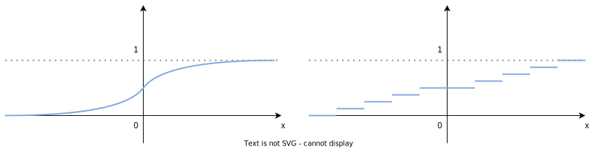
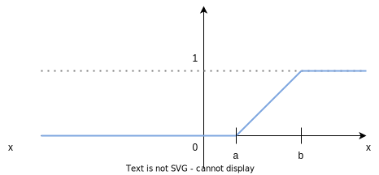

## Аксиоматика Колмогорова

Вероятностное пространство - это тройка $(\Omega, {\cal F}, P)$/

### $\Omega$

$\Omega$ - произвольное множество, элементами которого являются элементарные исходы.

### $\cal F$

$\cal F$ - любая совокупность подмножеств множества $\Omega$. По сути $\cal F$ - множество событий.

Свойства $\cal F$.

1. $\Omega \in \cal F$
2. $A\in {\cal F} \Rightarrow \overline A \in {\cal F}$, $\overline A := \Omega \backslash A$
   
   Из (1) и (2) $\Rightarrow \oslash \in \cal F$
3. $A,B\in {\cal F} \Rightarrow A \cup B \in {\cal F}, A \cap B \in {\cal F}$
   
   $\overline{A \cup B} = \overline{A} \cap \overline{B}$, $\overline{ \overline{A} \cup \overline{B}} = \overline{ \overline{A}} \cap \overline{\overline{B}}$
4. Бесконечное счетное множество $A_1, \ldots , A_n, \ldots \in {\cal F} \Rightarrow \bigcup\limits_{i=1}^{\infty} A_i \in {\cal F}, \bigcap\limits_{i=1}^{\infty} A_i \in {\cal F}$

$\cal F$ принятн называть $\sigma$-алгеброй событий (сигма-алгеброй событий).

"$\sigma$" указывает, что можно брать счетное пересечение, "аглебра", что можно складывать $\bigcap$ и умножать $\bigcup$.

Все выписанные свойства - это по сути аксиомы алгебры.

$\forall \sigma$-алгебра может быть рассмотрена как потенциальное множество событий.

Следующая $\sigma$-алгебра называется тривиальной - ${\cal F} = {\oslash, \Omega}$.

Если $\mid \Omega \mid < \infty$, т.е. $\Omega$ - конечное множество, то ${\cal F} = 2^\Omega$, где  $2^\Omega$ - стандартное обозначение для множества всех подмножеств $\Omega$, т.е. $\sigma$-алгебра состоит из всех возможных подмножеств. При этом $\mid {\cal F} \mid= 2^{\mid \Omega \mid}$.

Когда $\Omega$ - конечна, то имеем дискретную $\sigma$-алгебру.

### $P$

$P$ - вероятность или вероятностная мера. $P : {\cal F} \rightarrow [0,1]$ вероятностная мера - это функция, которая каждому событию присваивает некоторое числовое значение от $0$ до $1$.

Аксиомы:

1. $P(\Omega) = 1$
2. $P(\overline A) = 1 - P(A)$
3. $A,B \in {\cal F}, A \cap B = \oslash \Rightarrow P(A \cup B) = P(A) + P(B)$
4. Бесконечное счетное множество $A_1, \ldots , A_n, \ldots \in {\cal F}$ и $\forall i,j\ A_i\cap A_j = \oslash \Rightarrow P(\bigcup\limits_{i=1}^{\infty} A_i) = \sum\limits_{i=1}^{\infty} P(A_i)$

> **Парадокс Бертрана** Есть окружность и вписанный в нее равносторонний треугольник. Случайным образом выбирается хорда и ищется вероятность того, что выбранная хорда длиннее стороны треугольника.
> Можно взять две точки на окружности, можно взять любую точку внутри окружности и построить хорду, для которой точка будет серединой.
> Ответ на вопрос о вероятности будет зависеть от того, каким образом выбирается хорда.

## Случайные величины

В природе важно измерить некоторые числовые характеристики случайных объектов. Поэтому возникают случайные величины.

Если задано $(\Omega, \cal F, P)$, то случайная величина - это любая _измеримая_ функция $\xi : \Omega \rightarrow \mathbb R$, определенная на пространстве элементарных событий $\Omega$ и принимающая вещественный значений.

Мы рассматриваем вещественный значения случайной величины.

Функция называется измеримой, если $\forall
x \in \mathbb{R}\ \{ w \in \Omega : \xi(w) \le x \} \in \cal F$.

Измерима в том смысле, что мы можем измерить вероятность, с которой ее значение окажется не правее каждой точки на прямой.

**Пример**

Пусть $\Omega = \{1,2,3,4\}$, ${\cal F} = \{\oslash, \Omega\}$,  $\xi(1) = 1$,  $\xi(2) = 2$,  $\xi(3) = 3$,  $\xi(4) = 4$.

Тогда 

$x = 5 : \{ w \in \Omega : \xi(w) \le 5 \} = \Omega \in \cal F$.

$x = 3 : \{ w \in \Omega : \xi(w) \le 3 \} = \{1,2,3\} \not\in {\cal F} \Rightarrow$ функция $\xi$ не является случайной величиной.

Для данного $\cal F$ в качестве $\xi$ подходит $\xi = C$, где $C$ - константа.

## Фунция распределения случайной величины

$P (\xi \le x) = P(\{ w \in \Omega : \xi(w) \le x \})$, т.е. когда мы пишем $P (\xi \le x)$ мы подразумеваем $P(\{ w \in \Omega : \xi(w) \le x \})$.

Зная $P (\xi \le x)$ можно подсчитать $P (\xi \in B), B \subset \mathbb{R}$

$P (\xi \le x)$ - фунция распределения случайной величины

Также используется обозначение $F_\xi(x)$.

Свойства:
1. $F_\xi(x) \in [0,1]$
2. $F_\xi(x)$ - монотонно не убывает
3. $F_\xi(x)$ - непрерывна справа, т.к. в определении $\ldots \xi(w) \le x \ldots$. Если бы было $\ldots \xi(w) < x \ldots$, то "непрерывна слева"
4. $\lim\limits_{x\rightarrow\infty}F_\xi(x)=1$
5. $\lim\limits_{x\rightarrow -\infty}F_\xi(x)=0$

Примеры функции распределения для непрерывного и дискретного случаев

**Пример** Схема Бернулли. $n$ испытаний, $p$ - вероятность "успеха", $\mu_n$ - число успехов в $n$ испытаниях.

$w = \{x_1, \ldots, x_n \} \in \{0,1\}^n$

$\mu_n(w) := \sum\limits_{i=1}^n x_i$

$P(\mu_n = x) = C_n^x \cdot p^x \cdot q^{n-x}$

$P(\mu_n \le x) = \sum\limits_{k \le x} P(\mu_n = k)$

Такой функцией распределения задается биномиальная случайная величина.

$\mu_n \thicksim Binom(n,p)$ или $\xi \thicksim Binom(n,p)$

**Пример**

$\xi:\Omega \rightarrow \{0,1,2,\ldots \}$ - натуральные значения

$$
P(\xi = k) = \frac{\lambda^k\cdot e^{-\lambda}}{k!}
$$

$$
\sum_{k=0}^{\infty}\frac{\lambda^k\cdot e^{-\lambda}}{k!} = e^{-\lambda}\sum_{k=0}^{\infty}\frac{\lambda^k}{k!} = 1,
$$
так как $\displaystyle\sum\limits_{k=0}^{\infty}\frac{\lambda^k}{k!} = e^\lambda$ (ряд Тейлора)

Такой функцией распределения задается пуассоновская случайная величина.

$\xi \thicksim Poisson(\lambda)$

Это были примеры _дискретных_ распределений. Случайная величина называется дискретной, если она принимает либо конечное множество значений (пример 1), либо счетное множество значений (пример 2).

В этих случаях функция распределения не нужна, так как она задается вероятностями конкретных значений.

Для дискретной случайной величины $\xi:\Omega \rightarrow \{y_1, \ldots, y_n, \ldots \}$ ее распеределение задается через $p_1, \ldots, p_n, \ldots$, которые служат вероятностями значений $y_i$

## Абсолютно непрерывная случайная величина и плотность распределения случайной величины

Задана $p(x) \ge  0$, такая что $\displaystyle\int\limits_{-\infty}^{\infty} p(t) dt = 1$

$p(x)$ называется плотностью распределения

$\xi$ - абсолютно непрерывная случайная величина, если $\displaystyle F_\xi(x) = \int\limits_{-\infty}^x p(t) dt$

При этом для конкретного значения $P(\xi = x) = 0$

**Пример** Гауссовская или нормальная случайная величина

$$
p(x) = \frac{1}{\sqrt{2\pi}\sigma}\cdot e^{\frac{-(x-a)^2}{2\sigma^2}}
$$

$\xi \thicksim N (a, \sigma^2)$

$N(0,1)$ - _стандартная_ нормальная случайная величина

**Пример** Равномерно распределенная случайная величина

$[a,b]$ - отвезок

$\xi \thicksim R(a,b)$

$\xi$ имеет равномерное распределение на этом отрезка

$$
p(x) =
\Bigg\{
\begin{array}{ll}
\displaystyle\frac{1}{b-a} & a \le x \le b \\
\\
0, & else
\end{array}
$$

$\displaystyle P(\xi \in B) = \frac{\mu(B)}{b-a}$

