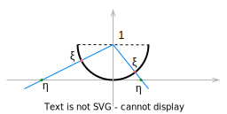

## Неравенство Маркова

Пусть $\xi$ - случайная величина. $\xi:\Omega \rightarrow \{ y_1, \ldots, y_k\}$.

$\forall i, y_i \ge 0$. Тогда $\displaystyle \forall a > 0, P (\xi \ge a) \le \frac{E\xi}{a}$.

$\square$

$$
E\xi = \sum\limits_{i=1}^k y_i\cdot P(\xi = y_i) = \sum\limits_{\displaystyle i: y_i \ge a} y_i\cdot P(\xi = y_i) + \sum\limits_{\displaystyle i: y_i < a} y_i\cdot P(\xi = y_i)
$$

Так как все $y_i \ge 0$, то $\sum\limits_{\displaystyle i: y_i < a} y_i\cdot P(\xi = y_i) \ge 0$.

$$
E\xi \ge \sum\limits_{\displaystyle i: y_i \ge a} y_i\cdot P(\xi = y_i) \ge a\cdot \sum\limits_{\displaystyle i: y_i \ge a} P(\xi = y_i) = a \cdot P(\xi \ge a)
$$

Окончательно имеем

$$
E\xi \ge a \cdot P(\xi \ge a)\ или\ P (\xi \ge a) \le \frac{E\xi}{a}
$$

$\blacksquare$

То же верно, если в формулировке теоремы будет строгое неравенство $y_i > 0$.

Неравенство Маркова справедливо для любых случайных величин, как дискретных, так и абсолютно непрерывных.

## Неравенство Чебышёва (следствие из теоремы Маркова)

$\forall \xi : D\xi < \infty$, т.е. $D\xi$ - конечна.

$\displaystyle \forall a > 0, P(\mid\xi - E\xi\mid \ge a)\le \frac{D\xi}{a^2}$.

Т.е. вероятность, с которой случайная величина $\xi$ отклоняется от своего среднего значения $E\xi$ в большую или меньшую сторону на наперед заданнйю величины $a$, ограничена сверху $\displaystyle\frac{D\xi}{a^2}$.

> Если $\xi$ принимает бесконечное множество значений, то у нее теоретически может вообще не быть $E\xi$ и $D\xi$.

$\square$

Введем новую случайную величину $\eta:=(\xi - E\xi)^2$, т.к. $\eta \ge 0 \Rightarrow$ к ней можно применить неравенство Маркова. Только вместо $a$ использовать $a^2$, т.к. в качестве $a$ мы можем использовать любое число.

$$
P(\eta\ge a^2) \le \frac{E\eta}{a^2} \\
\ \\
P((\xi - E\xi)^2\ge a^2) \le \frac{E(\xi - E\xi)^2}{a^2} = \frac{D\xi}{a^2} \\
\ \\
P(\mid \xi - E\xi \mid \ge a) \le \frac{D\xi}{a^2}
$$

$
\blacksquare
$

**Пример**

Случайная величина $\xi$ с плотностью распределение $\displaystyle p_\xi(x) = \frac{1}{\pi} \cdot \frac{1}{1 + x^2}$. Это распределение называется распределением Коши.

$p_\xi(x)$ - не отрицательна и $\displaystyle \int\limits_{-\infty}^{\infty} p_\xi(x) dx = 1$.

$$
E\xi = \int\limits_{-\infty}^{\infty} x\cdot p_\xi(x) dx = \int\limits_{-\infty}^{\infty}\frac{x}{\pi (1 + x^2)} dx
$$

Если $x$ занести под дифференциал, получим $\displaystyle d\frac{x^2}{2}$, т.е. имеем $dx^2$ и получаем интегрирование по $x^2$. Получаем $\log$ с точностью до константы и $\int\limits_{-\infty}^{\infty}$ от логарифма расходится, т.е. получаем случайную величину $\xi$ с бесконечным математическим ожиданием.

Диспрерсии $D\xi$ тоже нет и вообще не будет никаких моментов.

> Если $D$ существует, то и $E$ будет существовать.

Рассмотрим полуокружность с радиусом $1$. В точке $1$ стоит источник, который излучает частицы. Частицы как случайные величины равномерно распределены по полуокружности, т.е. вероятность попасть в некоторый кусочек этой полуокружности равен отношению длины кусочка к длине полуокружности.

Пролетая полуокружность частица достигает оси абсцисс. Тогда плотность распределения частиц на оси абсцисс имеет вид $\displaystyle p_\eta(x) = \frac{1}{\pi} \cdot \frac{1}{1 + x^2}$.

Т.е. мы имеем

$\displaystyle\xi \thicksim R(S \frac{1}{2})$ - $S$ - обозначает окружность

$\displaystyle\eta \thicksim C(1)$ - распределение Коши

> Плотность распределения - это производная от функции распределения.

У плотности распределения Коши "тяжелые" хвосты.

**Пример**

$G$ - случайный граф из $G(n,p)$, где $n$ - количество вершин, а $p$ - вероятность появления ребра в графе.

$p = p(n)$, т.е. $p$ может быть не константой, а функцией от числа вершин.

$\xi = \xi(G)$ - случайная величина, которая на конкретном графе $G$ равна числу треугольников.

Найдем $P(\xi = 0)$.

Напомним, что мы уже нашли $E\xi = C_n^3 p^3$.

**Теорема 1**

Если вероятность ребра случайного графа, как функция от $n$, такая что $p = p(n) \rightarrow 0$, т.е. $np \rightarrow 0$, при $n\rightarrow\infty$, то $P(\xi=0)\rightarrow 1$, при $np \rightarrow 0$.

Это говорит о том, что почти все графы в ассимптотике по числу вершин не имеют треугольников.

**Теорема 2**

Если вероятность ребра случайного графа, как функция от $n$, такая что $p = p(n) \rightarrow \infty$, т.е. $np \rightarrow \infty$, при $n\rightarrow\infty$, то $P(\xi=0)\rightarrow 0$, при $np \rightarrow \infty$.

Эти две теоремы являются некоторым "отражением" друг друга. Есть некоторый порог $\displaystyle\frac{1}{n}$.

И если $\displaystyle p \ll \frac{1}{n}$, то используется Теорема 1,
а если $\displaystyle p \gg \frac{1}{n}$, то Теорема 2.

*.*Теорема 1**

$\square$

$P(\xi = 0) = 1 - P(\xi \ge 1)$ и согласно неравенству Маркова $P(\xi = 0) \ge 1 - E\xi$.

Теперь достаточно доказать, что $E\xi \rightarrow 0$.

$$
E\xi = C_n^3p^3 = \frac{n(n-1)(n-2)}{6}\cdot p^3 \thicksim \frac{n^3}{6}\cdot p^3\rightarrow 0
$$

$\blacksquare$

**Теорема 2**

$\square$

Т.к. $\xi$ не принимает отрицательные значения, то применяя неравенство Чебышёва

$$
P(\xi = 0) = P(\xi \le 0) = P(-\xi \ge 0) = P(E\xi - \xi \ge E\xi) \le \\
\ \\
\le P(\mid E\xi - \xi \mid \ge E\xi) \le \frac{D\xi}{(E\xi)^2}
$$

В качестве $a$ в неравенстве Чебышёва можно взять $a=E\xi$.

> Это неравенство справедливо для $\forall$ случайных величин, которые принимают неотрицательные целые значения $0, 1, 2, \ldots$

$E\xi = C_n^3p^3, D_\xi=E_\xi^2 - (E_\xi)^2$

$\displaystyle E\xi^2=E(\xi_1 + \cdots + \xi_{C_n^3})^2 = E(\xi_1^2 + \cdots + \xi_{C_n^3}^2 + \sum\limits_{i\not=j}\xi_i\cdot\xi_j)$

Так как $\xi_i$ принимает только два значения $0$ или $1$, то квадраты можно убрать.

$\displaystyle E\xi^2 = E(\xi_1 + \cdots + \xi_{C_n^3} + \sum\limits_{i\not=j}\xi_i\cdot\xi_j) = E\xi + \sum\limits_{i\not=j}E(\xi_i\cdot\xi_j)$

Индикаторы появления $i$-го и $j$-го треугольников коррелированы, т.е. случайные величины $\xi_i$ и $\xi_j$ - зависимы.

При этом $\xi_i \cdot \xi_j = 1$, только если оба треугольника есть в графе. В противном случае, если хотя бы один из них отсутствует, $\xi_i \cdot \xi_j = 0$.

Существует три варианта для такой ситуации

Для первого случая $E(\xi_i \cdot \xi_j) = p^5$, так как требуется, чтобы появилось $5$ ребер.

Для второго и третьего случаев $E(\xi_i \cdot \xi_j) = p^6$, так как требуется, чтобы появилось $6$ ребер.

Продолжаем

$$
E\xi^2 = E\xi + \sum\limits_{i\not=j}E(\xi_i\cdot\xi_j) = E\xi + \\
\ \\
+ p^6\cdot C_n^3\cdot C_{n-3}^3 - это\ третий\ случай\ -\ все\ возможное\ количество\ вариантов\\
\ \\
+ p^6\cdot C_n^3\cdot 3 \cdot C_{n-3}^2 - это\ второй\ случай: 3-варианты\ для\ общей\ вершины\\
\ \\
+ p^5\cdot C_n^3\cdot 3 \cdot (n-3) - это\ первый\ случай: 3-количество\ пар\ для\ общих\ точек,\ (n-3) - варианты\ для\ одной\ вершины\\
\ \\
= E\xi + p^6\cdot C_n^3\cdot C_{n-3}^3 + p^6\cdot C_n^3\cdot 3 \cdot C_{n-3}^2 + p^5\cdot C_n^3\cdot 3 \cdot (n-3) = \\
\ \\
= E\xi + p^6\Big(C_n^3\cdot C_{n-3}^3 + C_n^3\cdot 3 \cdot C_{n-3}^2\Big) + p^5\cdot C_n^3\cdot 3 \cdot (n-3)
$$

Возвращаемся
$$
\frac{D\xi}{(E\xi)^2}=\frac{E_\xi^2 - (E_\xi)^2}{(E_\xi)^2} = \\
\ \\
= \frac{ E\xi + p^6\Big(C_n^3\cdot C_{n-3}^3 + C_n^3\cdot 3 \cdot C_{n-3}^2\Big) + p^5\cdot C_n^3\cdot 3 \cdot (n-3) - (E_\xi)^2}{(E_\xi)^2} = \\
\ \\
= \frac{1}{E\xi}-1+\frac{\displaystyle p^6\Big(\frac{n^3}{6}\cdot \frac{n^3}{6} \cdot (1 + o(1)) + \frac{n^3}{6} \cdot 3 \cdot \frac{n^2}{2}\cdot (1 + o(1))\Big) + p^5\cdot \frac{n^4}{6}\cdot 3}{\Big(\displaystyle\frac{n^3}{6}\cdot p^3 \cdot (1 + o(1))\Big)^2} = \\
\ \\
\ при\ np\rightarrow \infty \Rightarrow\frac{1}{E\xi} \rightarrow 0\\
\ \\
= o(1) - 1 + \Big(1+o(1)\Big) + \Big(o(1)\Big) + \frac{p^5n^4/2}{p^6n^6/36}\Big(1+o(1)\Big) = \\
\ \\
\ при\ np\rightarrow \infty \Rightarrow np^2\rightarrow \infty \\
\ \\
o(1) + o(1) + o(1)+\frac{1+o(1)}{pn^2}\cdot 18= o(1)
$$

$\blacksquare$

## Случайное блуждание

$$
\xi_i = 
\Bigg\{
\begin{array}{rl}
+1, & p = 1/2 \\
-1, & p = 1/2 \\
\end{array}
$$

$\eta_n = \xi_1 \cdots \xi_n$ - позиция пьяницы

Также $E\eta_n = 0$.

Найдем

$$
P(\eta_n > a) = P (\eta_n - E\eta_n > a) \le\\
\ \\
\le P (\mid \eta_n - E\eta_n\mid > a) \le \frac{D\eta_n}{a^2}
$$

Случайные величины $\xi_i$ - независимы в совокупности и $E\xi_i = 0$

$$
D\eta_n = D\xi_1 + \cdots + D\xi_n \\
\ \\
D\xi_i = E\xi_i^2 - (E\xi_i)^2 = E\xi_i^2 = 1,
$$
так как
$$
\xi_i = 
\Bigg\{
\begin{array}{rl}
+1, & p = 1/2 \\
-1, & p = 1/2 \\
\end{array}
$$

$$
\xi_i^2 = 
\Bigg\{
\begin{array}{rl}
+1^2 = 1, & p = 1/2 \\
(-1)^2 = 1, & p = 1/2 \\
\end{array}
\Rightarrow
\xi_i^2 = 
\bigg\{
\begin{array}{rl}
1, & p = 1
\end{array}
$$
И следовательно
$$
D\eta_n = D\xi_1 + \cdots + D\xi_n = n,
$$
а
$$
P(\eta_n > a) \le \frac{D\eta_n}{a^2} = \frac{n}{a^2}
$$

Для $n=10^6, a=10^4, P \le 0.01$, т.е. если пьяница будет делать миллион шагов, то вероятность уйти от кабака на десять тысяч шагов меньшь одной сотой.

**Теорема**

$$
P(\eta_n > a) \le e^{-a^2/2n}
$$

Напомним теорему Муавра-Лапласа
$$
P(\frac{\mu_n-np}{\sqrt{npq}} > x) \thicksim\frac{1}{2\pi}\int\limits_x^{\infty}e^{-t^2/2} dt
$$

Положим $\mu_n = \xi_1' + \cdots + \xi_n'$,

где 
$$
\xi_i' = \Bigg\{
\begin{array}{rl}
1, & p = 1/2 \\
0, & p = 1/2 \\
\end{array}
$$

$\displaystyle\xi_i' = \frac{\xi_i + 1}{2}$,

где 
$$
\xi_i = \Bigg\{
\begin{array}{rl}
1, & p = 1/2 \\
-1, & p = 1/2 \\
\end{array}
$$

Имеем
$$
P(\xi_1 + \cdots + \xi_n > a) = P\bigg(\frac{\xi_1 + \cdots + \xi_n + n}{2} > \frac{a+n}{2}\bigg) = \\
\ \\
= P\bigg(\xi_1' + \cdots + \xi_n' > \frac{a+n}{2}\bigg) = P\bigg(\mu_n> \frac{a+n}{2} = \bigg) = \\
\ \\
= P\bigg(\frac{\mu_n - n/2}{\sqrt{n/4}} > \frac{(a+n)/2 - n/2}{\sqrt{n/4}}\bigg) = P\bigg(\frac{\mu_n - n/2}{\sqrt{n/4}} > \frac{a}{\sqrt{n}}\bigg)
$$

Но в теореме Муавра-Лапласа $x$ - константа, а тут $x = x(n)$.