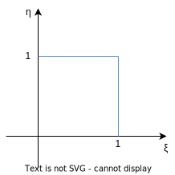
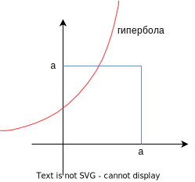
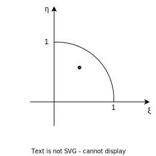

## Многомерное распределение случайных величин

Пусть $\xi_1, \ldots, \xi_n$ - случайные величины.

Не очень важна природа этого вероятностного пространста, а важно, как устроены вероятностные характеристики этих случайных величин, т.е. с какими вероятностями они принимают те или иные значения.

Можно смотреть на то, с какими вероятностями они одновременно принимают какие-то значения.

Возьмем функцию распределения $F_{\xi_1, \ldots, \xi_n}(x_1, \ldots, x_n) = P(\xi_1 \le x_1, \ldots, \xi_n \le x_n)$, т.е. пересекаем все события.

Одновременное заданные случайные величины $\xi_i$ не превосходят заданных наперед вещественных чисел.

$F_{\xi_1, \ldots, \xi_n}(x_1, \ldots, x_n)$ - многомерная функция распределения или функция совместного распределения $\xi_1, \ldots, \xi_n$ или функция распределения случайного вектора $\vec{\xi} = (\xi_1, \ldots, \xi_n), F_{\vec\xi}(\vec x)$.

Зная $F_{\vec\xi}(\vec x)$ можно подсчитать

$$
P(\vec\xi \in B) = \sum\limits_{\displaystyle\vec x \in B} P(\vec \xi = \vec x),
$$

где $B\in \mathbb{R}^n$ - многомерное множество.

Можно рассматривать дискретные и абсолютно непрерывные распределения.

Дискретное распределение предполагает конечное или счетное множество векторных значений.

$$
\vec\xi:\Omega \rightarrow \{ \vec{x_1}, \vec{x_2}, \ldots, \vec{x_n}\}, P(\xi_1 = x_1, \xi_2 = x_2, \ldots, \xi_n = x_n)
$$

Абсолютно непрерывное распределение предполагает наличие плотности $p_{\vec\xi}(\vec x)$ - неотрицательной функции, такй что

$$
\int\limits_{\mathbb{R}^n} p_{\vec\xi}(\vec x) d \vec x = 1
$$

$$
F_{\vec\xi}(\vec x) = \int\limits_{-\infty}^{x_1} \ldots \int\limits_{-\infty}^{x_n} p_{\vec\xi}(\vec t) dt
$$

**Пример**

Четверь круга на плоскости - $D$. Дана точка в круге, имеющая в нем равномерное распределение

$$
p_{\xi_1\xi_2}(x_1, x_2) =
\Bigg\{
\begin{array}{rl}
\displaystyle\frac{4}{\pi}, & \vec x \in D\\
\\
0, & \vec x \not\in D\\
\end{array}
$$

Вероятность попасть в подобласть $D$ - это интеграл по этой области от $p_{\xi_1\x_2}(x_1, x_2)$, т.е. отношение площадей. Поэтому мы говорим о равномерном распределении. Но случайные величины $\xi_1,\xi_2$, которые образуют такой случайный вектор точне не являются независимыми.

У функции распределения одной случайной величины $F_{\xi_1}(x_1)$ есть стандартные свойства:

- Монотонно не убывает
- Непрерывна справа
- $\lim\limits_{x_1\rightarrow + \infty} F_{\xi_1}(x_1) = 1$
- $\lim\limits_{x_1\rightarrow - \infty} F_{\xi_1}(x_1) = 0$

Если взять какую-то функцию и она будет обладать этими четырмя свойствами, то можно доказать, что такая функция является функцией распределения для некоторой случайной величины.

Рассмотрим многомерную функцию распределения $F_{\vec\xi}(\vec x)$.

- Монотонно не убывает по каждой отдельно взятой переменной при фиксированных остальных
- Непрерывна справа по каждой переменной при фиксированных остальных

- $\lim\limits_{
\begin{array}{l}
x_1\rightarrow + \infty \\
\vdots \\ 
x_n\rightarrow + \infty \\
\end{array}
} F_{\vec\xi}(\vec x) = 1$

- $\lim\limits_{x_i\rightarrow - \infty} F_{\vec\xi}(a_1, \ldots, a_{i-1}, x_i, a_{i+1}, \ldots, a_n) = 0$, $a_j$ - зафиксированы

В случае $F_{\xi_1}(x_1)$ всё определено однозначно, т.е. свойства являются необходимыми и достаточными.

Для $F_{\vec\xi}(\vec x)$ требуется еще одно свойство, которое не описывается в двумерном и более высокомерном случае свойство монотонности.

> Свойство монотонности на прямой гарантирует, что вероятность попадания в любой интервал не отрицательна.

Из свойства монотонноти по отдельным координатам не следует неотрицательность попадания в многомерный интервал.

**Пример**

Рассмотрим $F(x,y) = I_{\{x+y\ge 1\}}$ - индикатор, что сумма больше $1$.

Проверим свойства:

- Монотонности есть. Зафиксируем $x$, меняем $y$. В какой-то момент сумма перейдет $1$ и $I$ станет равным $1$.
- Непрерывность справа тоже есть
- $\lim\limits_{
\begin{array}{l}
x\rightarrow + \infty \\
y\rightarrow + \infty \\
\end{array}
} F(x,y) = 1$
- $\lim\limits_{x_i\rightarrow - \infty} F(x,a) = 0$

Предположим, что существует $(\xi,\eta): F_{\xi,\eta}(x,y) = F(x,y) = I_{\{x+y\ge 1\}}$.

Какова вероятность того, что вектор попадет в квадрат?

$$
P((\xi,\eta) \in [0,1]^2) = P(\xi\le 1, \eta\le 1) - P(\xi\le 1, \eta\le 0) - \\
\ \\
- P(\xi\le 0, \eta\le 1) + P(\xi\le 0, \eta\le 0) =  \\
\ \\
= F(1,1) - F(1,0) - F(0,1) + F(1,1) = 1 - 1 - 1 + 0 = -1,
$$
т.е. из монотонности по отдельным переменным не следует, что вероятность на квадратах или прямоугольниках корректно определена, а значит это свойство требуется оговорить заранее.

Введем оператор $\Delta$. Пусть $F(x,y)$ - функция от двух переменных. Тогда
$$
\Delta_{a_1, b_1} F(x,y) = F(b_1, y) - F(a_1,y)
$$
$$
\Delta_{a_2, b_2} F(x,y) = F(x, b_2) - F(y, a_2)
$$

Индекс $1$ показывает, что оператор $\Delta$ действует на первую переменную, а $2$ на вторую. $\Delta$ - формальный оператор, индекс которого это концы отрезка, к которому мы применяем эту разность.

Если написать композицию
$$
\Delta_{a_1, b_1} \Delta_{a_2, b_2} F(x,y) = \Delta_{a_1, b_1} \Big( F(x, b_2) - F(y, a_2)\Big) = \\
\ \\
= F(b_1, b_2) - F(a_1, b_2) - F(b_1, a_2) + F(a_1, a_2)
$$

Чередование знаков и точки, в который все берется - это и есть вероятность попадания в прямоугольник со сторонами $(a_1, b_1)(a_2, b_2)$.

Если мы будет в таких терминах писать в общем случае, то имеем пятое свойство
$$
\forall\ a_1, b_1, a_2, b_2, \ldots, a_n, b_n \\
\ \\
\Delta_{a_1, b_1} \Delta_{a_2, b_2} \cdots \Delta_{a_n, b_n} F_{\vec\xi}(\vec x) \ge 0
$$

Это и есть вероятность попадания в "параллелипипед", который представляет собой декартово произведение вот таких отрезков $(a_1, b_1), (a_2, b_2), \ldots, (a_n, b_n)$.

Любая функция, которая этимим свойствами обладает найдет себе случайный вектор, для которого функция распределения и равна этой функции.

Знание про совместное распределение позволяет решать задачи о том, как устроено распределение разных функций от нескольких случайных величин.

## Формула свертки

Рассмотрим две случайные величины $\xi, \eta$. Будет считать, что они независимы, дискретны и каждое принимает конечное множество значений.

Нас интересует распределение суммы $\xi + \eta$.

**Пример**

$\xi: \Omega \rightarrow \{x_1, \ldots, x_n\}$

$\eta: \Omega \rightarrow \{y_1, \ldots, y_m\}$

Множество значений могут пересекаться.

$P(\xi + \eta = z)$, где $z$ - любое из чисел, которые можно получить суммированием какого-нибудь $x$ и какого-нибудь $y$.

$$
P(\xi + \eta = z) = \\
\ \\
Формула\ полной\ вероятности\\
\ \\
= \sum\limits_{i=1}^m P(\eta = y_i, \xi + \eta = z) = \sum\limits_{i=1}^m P(\eta = y_i, \xi  = z - y_i) = \\
\ \\
случайные\ величины\ независимы\\
\ \\
\sum\limits_{i=1}^m P(\eta = y_i) P(\xi  = z - y_i)
$$

Это и называеся _сверткой_ двух распределений.

Для абсолютно непрерывных величин аналогом вероятности $P$ является плотность $p$.

$$
p_{\xi+\eta}(z) = \int\limits_{\mathbb{R}} p_\eta(y)\cdot p_\xi(z-y) dy
$$

Это свертка плотностей распределения.

**Пример**

$\xi \thicksim Poisson(\lambda)$, $\eta \thicksim Poisson(\mu)$.

Пуассоновские случайные величины принимают все неотрицательные целые значения.

$$
P(\xi + \eta = z) = \sum\limits_{y=0}^{\infty} P(\eta = y)\cdot P(\xi = z-y) = \\
\ \\
так\ как\ пуассоновские\ случайные\ величины\ только\ положительные \\
\ \\
= \sum\limits_{y=0}^z \frac{\lambda^y\cdot e^{-\lambda}}{y!} \cdot \frac{\mu^{z-y}\cdot e^{-\mu}}{(z-y)!} = e^{-(\lambda + \mu)} \sum\limits_{y=0}^z \frac{\lambda^y\cdot \mu^{z-y}}{y!(z-y)!} = 
\ \\
= \frac{e^{-(\lambda + \mu)}}{z!} \sum\limits_{y=0}^z z! \cdot \frac{\lambda^y\cdot \mu^{z-y}}{y!(z-y)!} = \frac{e^{-(\lambda + \mu)}(\lambda+\mu)^z}{z!},
$$
т.е. имеем $\xi + \eta \thicksim Poisson(\lambda + \mu)$.

Математическая ожидание суммы всегда сумма математических ожиданий. И это неважно зависимы ли величины или нет, поэтому относительно математического ожидания полученный результат ясен, но тот факт, что в результате мы опять получили пуассновскую величину следует из независимости случайных величин.

**Пример**

$\xi \thicksim N(a_1,\sigma_1^2)$

$\eta \thicksim N(a_2,\sigma_2^2)$

Независимые гауссовские случайные величины.

Тогда $\xi + \eta \thicksim N(a_1 + a_2, \sigma_1^2 + \sigma_2^2)$.

Математические ожидания складываются всегда, а дисперсии складываются из-за независимости.

Пусть $\xi_1,\ldots, \xi_n$ - случайные величины и известно, что $P(\xi_1 = x_1, \ldots, \xi_n = x_n)$ или $P_{\vec\xi}(\vec x)$.

Нас интересует функция от наблюдений $f(\xi_1,\ldots, \xi_n)$, которую называют _статистикой_ или _оценкой_ и ее распределение.

> Если $\xi_i \thicksim N(0,1)$ и независимы в совокупности и $f(\xi_1,\ldots, \xi_n) = \xi_1^2 + \cdots + \xi_n^2$, то ее распределение называется $\chi_n^2$ - хи-квадрат распределение с $n$-степенями свободы.

Функция распределения

$$
F_{f(\xi_1,\ldots, \xi_n)}(x) = P(f(\xi_1,\ldots, \xi_n) \le x) = \\
\ \\
P(\vec\xi\in D = \{\vec x : f(\vec x) \le x\}) = 
\Bigg\{
\begin{array}{l}
\displaystyle \int\limits_D p_{\vec\xi}(\vec x) d \vec x \\
\\
\sum\limits_{\vec x \in D} P(\vec\xi = \vec x)
\end{array}
$$

**Пример**

$\xi \thicksim R(0,a)$, $\eta \thicksim R(0,a)$, независимы

Какое распределение у $\xi\cdot\eta$ ?

$$
P(\xi\cdot\eta \le x) = P ( (\xi, \eta) \in \{ (u,v), u\cdot v \le x\})
$$

**Пример**

Найти математическое ожидание от $f$.

$$
Ef(\xi_1,\ldots,\xi_n) = \int\limits_{\mathbb{R}^n} p_{\vec\xi}(\vec x)\cdot f(\vec x) d \vec x
$$

**Пример**

$$
\rho(\xi,\eta) = \frac{cov(\xi,\eta)}{\sqrt{D\xi \cdot D\eta}} = \frac{E(\xi\eta) - (E\xi)(E\eta)}{\sqrt{D\xi \cdot D\eta}} 
$$

$$
E(\xi\eta) = \int\limits_{\mathbb{R}^2} xy \cdot \frac{4}{\pi}\cdot I_{\{x,y \in D\}} dx dy = \int\limits_D xy \cdot \frac{4}{\pi}\ dx dy 
$$

Интегрирует по $x$ от $0$ до $1$ и по $y$ от $0$ до $\sqrt{1 - x^2}$