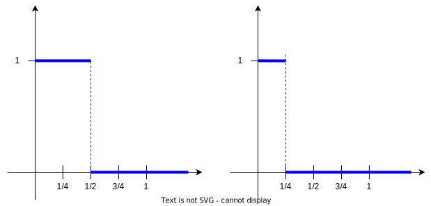

## Виды сходимостей последовательностей случайных величин

Обычные одномерные случайные величины $\xi_1, \ldots, \xi_n, \ldots : \Omega \rightarrow\mathbb{R}$ действуют на одном и том же пространстве $\Omega$.

У нас есть последовательность случайных величин. В каком смысле она могла бы иметь некоторый предел?

Три вида сходимости

**1. Сходимость по вероятности**

$$
\xi_n \xrightarrow[n \to \infty]{P}\xi,\ если\ \forall \varepsilon > 0\ P(\mid \xi_n - \xi\mid \ge \varepsilon)\xrightarrow[n \to \infty]{} 0
$$

Последовательность $\xi_n$ сходится к некоторой случайной величине $\xi$ по вероятности при $n \rightarrow \infty$.

Смысл: Скольким бы маленьким мы не выбрали $\varepsilon$, мера тех $w$ из $\Omega$, на которых значение $\xi_n$ от значения предельного $\xi$ отличается больше чем на $\varepsilon$. Мера этого множества стремится к $0$ при $n\rightarrow \infty$.

Т.е. крайне мало множество тех элементарных исходов, на которых значение $\xi$ с большими номерами уклоняются от значения предельного $\xi$ больше, чем на наперед заданную $\varepsilon$.

Мы хотим найти некую единую случайную величину, которая при достоточно больших $n$ мало отличается от $\xi$.

$\xi_n$ - можно рассматривать как результат эксперимента или результат наблюдений за неким процессом.

Если с ростом числа этих экспериментов, с ростом числа наблюдений мы находим какую-то единую "штуковину" $\xi$, которая мало от него отличается, то говорим, что $\xi_n$ сходится по вероятности к $\xi$.

**2. Сходимость "почти наверное"**

$$
P\Big(\lim\limits_{n\rightarrow\infty} \xi_n(w) = \xi(w)\Big) = 1
$$

Если взять случайные элемент $w \in \Omega$, то почти наверное, т.е. с вероятностью $1$, обычная числовая последовательность, составленная из $\xi_n(w)$ имеет предел $\xi(w)$.

Берем $w\in\Omega$ и подставляем в качестве аргумента в каждую из случайных величин $\xi_n$, получаются конкретные числа. Смотрим на предел такой числовой последовательности и проверяем, совпадает ли он с $\xi(w)$ и почти всегда это должно быть так.

$$
\xi_n \xrightarrow[n \to \infty]{п.н.}\xi
$$

**3. Сходимость по распределению**

$$
\xi_n \xrightarrow[n \to \infty]{d}\xi, d - distribution
$$

$$
F_{\xi_n}(x)\xrightarrow[n \to \infty]{}F_{\xi}(x),x\in\mathbb{R}
$$

Берем функцию распределения величины $\xi_n$, т.е. $F_{\xi_n}(x)$ и смотрим ее в точке $x$. Это будет число, и хочется, чтобы такая числовая последовательность при $n\rightarrow\infty$ сходилось к $F_\xi(x)$, что тоже число. При этом все будет работать для $\forall x: F_\xi (x)$ - непрерывна в точке $x$.

Сходимость по распределению предполагает, что последовательность функций распределения $F_{\xi_n}(x)$ взятых в почти произвольной точке $x$ сходятся к значению этой самой предельной функции распределения $F_\xi$.

Понятно, что $F_{\xi_n}(x) = P(\xi_n \le x)$, а $F_{\xi}(x) = P(\xi \le x)$

**Пример 1**

ЗБЧ (Закон Больших Чисел)

Есть $\xi_1, \ldots, \xi_n, \ldots$ - одинакого распределенные, попарно некоррелированные и конечными и одинаковыми дисперсиями и математическими ожиданиями: $D\xi_1 < \infty$, $E\xi_1 < \infty$.

$$
\forall \varepsilon >0\ P(\mid \frac{\xi_1 + \cdots \xi_n}{n} - E\xi_1\mid \ge \varepsilon) \to 0, n \to \infty \Leftrightarrow \frac{\xi_1 + \cdots \xi_n}{n}\xrightarrow[n \to \infty]{P} E\xi_1
$$

Следует из определения сходимости по вероятности.

Последовательность средних сходится по вероятности к математическому ожиданию каждой из этих случайных величин.

**Пример 2**

Теорема Муавра-Лапласа и теорема Пуассона

$\mu_n = \xi_1 + \cdots + \xi_n$, где $\xi_i$ - независимые и $P(\xi_1 = 1) = p, P(\xi_i = 0) q = 1 - p$.

$\forall a,b \in \mathbb{R}, P\Bigg(\displaystyle\frac{\xi_1 + \cdots + \xi_n - np}{\sqrt{npq}} \in [a,b]\Bigg)\xrightarrow[n\to\infty]{} \frac{1}{\sqrt{2\pi}} \int\limits_a^b e^{\frac{-x^2}{2}} dx = \Phi(b) - \Phi(a)$

> $\Phi(t) := \displaystyle\frac{1}{\sqrt{2\pi}} \int\limits_{-\infty}^t e^{\frac{-x^2}{2}} dx$ - стандартное обозначение для функции нормального распределения.

Если напишем

$$
P\Bigg(\displaystyle\frac{\xi_1 + \cdots + \xi_n - np}{\sqrt{npq}} \le b\Bigg)\xrightarrow[n\to\infty]{} \Phi(b),
$$

то получим сходимость по распределению.

$np$ - математическое ожидание, $\sqrt{npq}$ - корень из дисперсии, т.е. мы нормировали случайную величины и получили для нее $M\mu = 0, D\mu = 1$.

> Так как $D(c\cdot \mu) = c^2\cdot D\mu$, то $\displaystyle D\Bigg(\frac{\mu}{\sqrt{D\mu}}\Bigg) = \frac{1}{(\sqrt{D\mu})^2}\cdot D\mu = \frac{D\mu}{D\mu} = 1$

Те же характеристики имеет стандартная нормальная случайная величина $N(0,1)$.

Таким образом имеем сходимость к абсолютно непрерывной гауссовской случайной величине.

$$
\frac{\mu_n - np}{\sqrt{npq}} \xrightarrow[n\to\infty]{d} \mu \thicksim N(0,1)
$$

Такаяже сходимость по распределению присутствует в теореме Пуассона, но с другими условиями.

Теорема Пуассона говорит, что если в схеме Бернулли вероятность успеха зависит от числа испытаний и ассимптотически ведет себя как $\displaystyle\frac{\lambda}{n}$, т.е. $p = p(n) = \displaystyle\frac{\lambda}{n}$ при $n\to\infty$, то

$$
\forall k\in \mathbb{N} \cup {0}(натурального\ и\ нулевого)\ P(\mu_n = k)\thicksim \frac{\lambda^k e^{-\lambda}}{k!}
$$

Или по другому имеем сходимость к дискретной пуассоновской случайной величине

$$
\mu_n\xrightarrow[n\to\infty]{d}\mu\thicksim Poisson(\lambda)
$$

В обоих случаях мы апроксимируем функции распределения.

## Соотношение между сходимостями

**Теорема**

Если $\xi_n \xrightarrow[n\to\infty]{п.н.} \xi \Rightarrow \xi_n \xrightarrow[n\to\infty]{P} \xi$.

Приведем пример, когда есть сходимость по вероятности $\xi_n \xrightarrow[n\to\infty]{P} \xi$, но нет сходимости "почти наверное". Более того, ни в одной точке не будет сходимости.

$$
\xi_1(w) = \Bigg\{
\begin{array}{rl}
1, & w \in [0, 1/2]\\
0, & иначе\\
\end{array};
\ 
\xi_2(w) = \Bigg\{
\begin{array}{rl}
1, & w \in [1/2, 1]\\
0, & иначе\\
\end{array}
$$

$$
\xi_3(w) = \Bigg\{
\begin{array}{rl}
1, & w \in [0, 1/4]\\
0, & иначе\\
\end{array};
\ 
\xi_4(w) = \Bigg\{
\begin{array}{rl}
1, & w \in [1/4, 1/2]\\
0, & иначе\\
\end{array}
$$
$$
\xi_5(w) = \Bigg\{
\begin{array}{rl}
1, & w \in [1/2, 3/4]\\
0, & иначе\\
\end{array};
\ 
\xi_6(w) = \Bigg\{
\begin{array}{rl}
1, & w \in [3/4, 1]\\
0, & иначе\\
\end{array}
$$
и т.д.

Примеры для $\xi_1$ и $\xi_3$.

> Случайная величина - это функция, которая совершенно детерминирована. Она случайна только в том смысле, что мы считаем саму точку на отрезке случайной.

Фиксируем $\varepsilon > 0$. Найдем $P(\xi_n \ge \varepsilon)$. Можно написать "модуль", но $\xi$ не принимает отрицательных значений.

Найдем с какой вероятностью $\xi_n$ отличается от $\varepsilon$.

$$
P(\xi_1 \ge \varepsilon) = P(\xi_2 \ge \varepsilon) = 1/2 
$$

$$
P(\xi_3 \ge \varepsilon) = P(\xi_4 \ge \varepsilon) =  P(\xi_5 \ge \varepsilon) = P(\xi_6 \ge \varepsilon) = 1/4
$$
и т.д.

Получаем
$$
P(\xi_n \ge \varepsilon) \rightarrow 0, n\to\infty,т.е.\ \xi_n\xrightarrow[n\to\infty]{P} 0
$$

Верно ли, что $\lim\limits_{n\to\infty} \xi_n(w) = 0$ ?

Имеем $\forall w, N$ существует $n > N: \xi_n(w) = 1$, т.е. сходимости нет ни в одной точке $w$.

Сходимость "почти наверное" сильнее, чем сходимость по $P$.

Сходимость по распределению слабее всех остальных сходимостей.

Сходимость по распределению - это о том, на сколько похожа функция распределения, но ни сами случайные величины, как функции их элементарных объектов.

**Теорема**

Пусть $\xi_1 + \cdots + \xi_n$ независимы, но не требуем, чтобы они были одинакого распределены. Пусть также $\displaystyle\sum\limits_{n=1}^\infty \frac{D\xi_n}{n^2} < \infty$.

Тогда

$$
\frac{\xi_1 + \cdots + \xi_n}{n} - E\Big(\frac{\xi_1 + \cdots + \xi_n}{n} \Big) \xrightarrow[n\to\infty]{п.н.} 0
$$

В этом пределе нельзя перенести $\displaystyle E\Big(\frac{\xi_1 + \cdots + \xi_n}{n} \Big)$ в правую часть, т.к. она зависит от $n$, а справа должна стоять константа.

Условие $\displaystyle\sum\limits_{n=1}^\infty \frac{D\xi_n}{n^2} < \infty$ выполняется если все $D$ ограничены одной и той же константой.