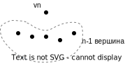

## web-граф

web-граф возникает при рассмотрении сети Интернет.

Вершины - сайты (или страницы)

Ребра - ссылки, которые ведут с одного сайта на другой, т.е. граф - ориентированный. Также это мультиграф, так как могут быть кратные ребра. Могут быть петли, кратные петли - ссылки между страницами в рамках одного сайта.

С ростом количества вершин есть наблюдаемые свойства, которые не меняются с течением времени.

В конце 1999 годов начали изучать статистические свойства web-графов. Barabasi, Albert

Три свойства:

1.  Число ребер растет линейно от числа вершин, т.е. web-граф - крайне разреженный (ребра встречаются редко). Если $n$-вершин, то ребер $\thicksim m\cdot n$, где $m$ - некоторая константа.

2.  "6 рукопожатий", "мир тесен"

$diam\ G \thicksim 6-10$ - диаметр графа - максимальное расстояние между парами его вершин, а расстояние между двумя вершинами - это длина кратчайшей цепочки, которая их соединяет.

3. Степенной закон распределения степеней вершин

Степень вершины - количество ребер, которые примыкают к вершине (входят, выходят, их сумма).

Степень вершины web-графа как случайная величина подчиняется степенному закону распределения.

Вероятность убывает не экспоненциально, а полиномиально, как степень от числа вершин.

Если разделить количество вершин, имеющих степень $d$ на количество всех вершин в web-графе, т.е. $n$ то получится $\displaystyle\thicksim \frac{const}{d^{2.27}}$

Чтобы найти константу нужно вспомнить, что $\displaystyle\sum\limits_{d = 1}^\infty \frac{const}{d^{2.27}} = 1$

**Предпочтительно присоединение**

деньги к деньгам - ссылки к ссылкам

Если на сайт много ссылок (большая цитируемость), то тогда при добавление новые сайтов у него больше шансов получить новые ссылки.

Вероятность присоединения должна быть пропорциональна степени вершины, к которой происходит присоединение.

**Модель Bollobas, Riordan Oliver (Б-Р)**

Модель учитывает тот факт, что присоединяться надо к вершинам большей степени, причем так, чтобы вероятность присоединиться к вершине какой-либо степени была пропорциональна этой самой степени.

Перед рассмотрением модели Б-Р рассмотрим другую модель.

Зафиксируем $n$ и попробуем построить случайный граф на $n$ вершинах.

Такой граф можно построить разными способами.

Рассмотрим случайный граф $G(n,p)$ - с $n$ вершинами $\{1,2,\ldots,n\}$, где каждое ребро возникает с вероятностью $p$ независимо от остальных ребер.

Модель достаточно плохо согласуется с реальностью. Вряд ли в реальном Интернете ребра возникают с вероятностью $p$ и при этом независимы друг от друга.

Но тем не менее попробует на таком графе реализовать разряженность, т.е. на $n$ вершинах должны быть $n\cdot m$ ребер.

Если взять $G(n,p)$, то какое у него среднее число ребер?

$$
E(число\ ребер) = C_n^2\cdot p \thicksim \frac{n^2\cdot p}{2} = \frac{n^2\cdot 2m}{2\cdot n} = mn
$$

Объяснит сделанные преобразования. Если $p$-константа, то граф получится очень плотным - $C_n^2$. Давайте считать, что $p$ - это функция от $n$, т.е. $p = p(n)$, которая стремится к $0$ при $n\to\infty$.

Возьмем $p(n) = \displaystyle\frac{2m}{n}$ и получим окончательную формулу.

Пусть дана какая-то вершина этого графа - $v$ из множества от $1$ до $n$ и дана какая-то другая вершина из оставшихся $n-1$ вершин.

Какова вероятность $P(deg\ v = k)$, что степень вершины $v$ в таком графе равна $k$, где $0 \le k \le n-1$?

Т.е. интересует вероятность того, что из вершины $v$ в это "облако" из $n-1$ вершины пойдет $k$ ребер.

Это схема испытаний Бернулли.

$$
P(deg\ v = k) = C_{n-1}^k\cdot p^k \cdot q^{n-1-k}
$$

Таким образом, наша случайная величина, распределение которой мы рассматриваем $\xi_n \thicksim Binom(n-1,p)$ - биномиальная случайная величина.

О том, как ведет себя такая случайная величина говорит предельная теорема Пуассона.

$$
\xi_n \xrightarrow[n\to\infty]{d}\eta\thicksim Poisson(2m),
$$
т.е. распределение этой случайной величины очень похоже на Пуассоовское, т.е. $\displaystyle\frac{c^k\cdot e^{-c}}{k!}$, где $c = 2m$.

Но тогда получается экспоненциальный закон, а не степенной!

Поэтому такая модель графа не подходит.

Теперь рассмотрим модель Б-Р.

Сначала зафиксируем $m=1$, где  $m$ - отношение числа ребер к числу вершин.

Вообще-то $m\ge 1$, так как мы хотим, чтобы граф получился связанным, а если на $n$ вершинах находится менее чем $n-1$ ребро, то это не дерево, а граф, который разделен на отдельные связанные компоненты.

> У связанного графа на $n$ вершинах обязательно $n-1$ ребро.

Назовем граф, который будем строить для $m=1$ - $G_1^n$. $m=1$ - это минимальное значение $m$, $n$ - число вершин, а число ребер - $m\cdot n = 1 \cdot n = n$.

Строить граф будем по индукции, на каждом шаге добавляя одно ребро и одну вершину.

На первом этапе для $G_1^1$ имеем одну вершину с петлей.

К моменту времени $n-1$ образуется граф с $n-1$ вешинами и $n-1$ ребром. Это - предположение индукции.

Теперь добавим новую вершину.

Эта вершина должна решить, куда "отправить" ссылку.

В рамках модели Б-Р вершина может поставить ссылку на себя (сделать петлю) или поставить ссылку на какую-то из уже имеющихся вершин.

Выбор определяется с точностью до вероятности, т.е. есть вероятность образования петли, а есть вероятность присоединиться к конкретной вершине.

Мы хотим так подобрать эти вероятность, чтобы их сумма равнялась $1$, а кроме того надо реализовать замысел на предмет предпочтительного соединения, т.е. добиться того, что вероятность была пропорциональна степеням вершин, которые имели место в момент времени $n-1$, т.е. на предыдущей итерации.
$$
P(v_n \rightarrow v_n) = \frac{T}{2n-1}
$$

$$
P(v_n \rightarrow v_i) = \frac{deg\ v_i}{2n-1}, i\in(1,n-1)
$$

Ясно, что сумма этих вероятностей равна $1$.

> Сумма степеней вершин любого графа равна удвоенному числу ребер.

В рамках этой модели разряженность соблюдается при $n=1$, но нужно проверить и остальные свойства.

Данная модель работает только для целых, натуральных чисел.

Рассмотрим случай $m \ge 2$.

Построим $G_1^{m\cdot n}$, у которого $mn$ - вершин и $mn$ - ребер.

Вершины $v_1, \ldots, v_m, v_{m+1}, \ldots, v_{2m}, \ldots, v_{m(n-1)+1}, \ldots, v_{mn}$ разобьем на группы мощности $m$ и проведем переименование.

$W_1$ - это вершины $v_1, \ldots, v_m$.

$W_2$ - это вершины $v_{m+1}, \ldots, v_{2m}$.

$W_n$ - это вершины $v_{m(n-1)+1}, \ldots, v_{mn}$.

Т.е. мы как-бы "схлопываем" вершины в одну. При этом если внутри вершин новой группы были ссылки мы их превращаем в кратные петли из $W_i \rightarrow W_i$.

Перекрестные ребра из превращаются в кратные ребра $W_i \rightarrow W_j$.

Получается, что у нового графа есть $n$-вершин, но осталось столько же ребер - $mn$, т.е. мы получили новый $G_m^n$ - граф, который можем построить для произвольного $n$.

Понятно, что при $m=1$ такакя "склейка" не нужна.

**Теорема 1**

Рассмотрим диаметр случайного графа $G_m^n$, как случайную величину. Тогда $\forall \varepsilon > 0,\ m\ge 2$
$$
P\Big( (1-\varepsilon)\frac{\ln n}{\ln \ln n} \le diam\ G_m^n \le (1+\varepsilon)\frac{\ln n}{\ln \ln n} \Big)\xrightarrow[n\to\infty]{} 1
$$

По факту - это сходимость по вероятности
$$
\frac{diam\ G_m^n}{ \ln n / \ln \ln n} \xrightarrow[n\to\infty]{P} 1
$$

**Теорема 2**

$\forall m \ge 1, \forall \varepsilon > 0$

$$
P\Big( (1-\varepsilon)\frac{2m(m+1)}{(d+m)(d+m+1)(d+m+2)} \le \frac{количество\ вершин\ G_m^n степени\ d}{n} \le \\
\ \\
\le (1+\varepsilon)\frac{2m(m+1)}{(d+m)(d+m+1)(d+m+2)} \xrightarrow[n\to\infty]{} 1
$$

Можно показать, что 
$$
\frac{2m(m+1)}{(d+m)(d+m+1)(d+m+2)} \thicksim \frac{const}{d^3}
$$

Существует более точная модель Бакли-Остгуса.
